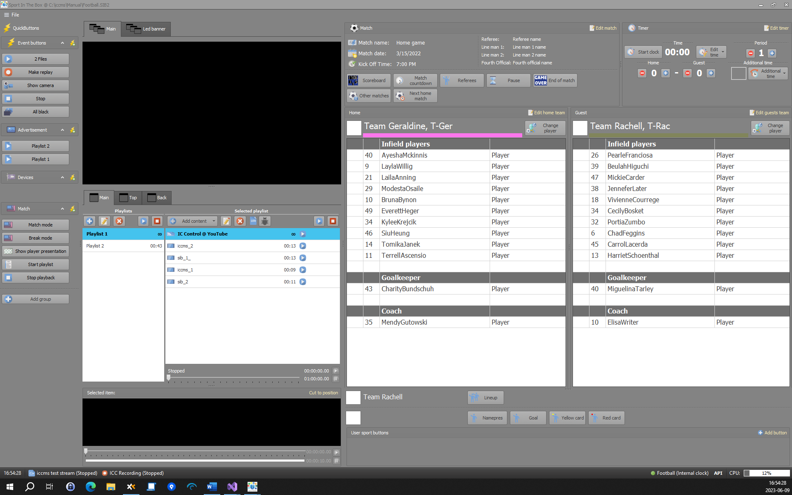
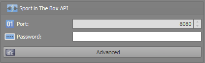
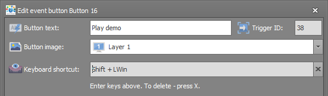

# companion-module-iccms-sib

Bitfocus Companion module for [Sport In The Box 2](https://www.iccmediasport.com/en/sport-in-the-box/) (SIB2) — a production and playout system for live content on videoboards, in-house TV systems, and streaming.



## Features

- Fire QuickButtons from Stream Deck
- Open and change SIB database
- Change team

## Installation

1. [Download and install Companion v3+](https://bitfocus.io/companion)
2. In Companion, add a new connection and search for **Sport In The Box**

New to Companion? Watch [Getting Started with Companion](https://www.youtube.com/watch?v=jjbxzVrAG4M) or [Working with Companion Variables](https://www.youtube.com/watch?v=ONDNFpv-uCM).

## Setup

### SIB API Password

Set the API password in SIB under **Settings > General > API**, then enter it in the module connection settings in Companion.



### Triggering QuickButtons

The module fires QuickButton events using the **Trigger ID** shown in SIB.



## Development

- **Package manager**: Yarn
- **Tests**: `yarn test`
- **Build**: `yarn dist`
- **Dev**: `yarn dev`
- **Node version**: 18.12+

See the [module development wiki](https://github.com/bitfocus/companion-module-base/wiki) for general Companion module guidance.

### Debug files

Local-only debug toggles (gitignored via `DEBUG-*`) — create when needed, never commit:

| Artifact | What's needed |
| --- | --- |
| `DEBUG-INSPECT` | Runs the module with the Node inspector to attach a debugger. |
| `DEBUG-PACKAGED` | Runs the built `pkg/` code instead of `src/`. |

### Troubleshooting

#### `yarn install` fails on Windows with `UNKNOWN: unknown error ... archive.zip`

If `yarn install` aborts during the **Fetch step** with an error like:

```text
➤ YN0001: │ Error: @faker-js/faker@npm:8.3.1: UNKNOWN: unknown error, open 'C:\Users\<you>\AppData\Local\Temp\xfs-xxxxxxxx\archive.zip'
```

a real-time antivirus is quarantining the package archive that Node writes while building Yarn's cache, then removing the temp folder out from under it. It usually trips on the largest package in the tree (here `@faker-js/faker`), and the temp path changes every run. Confirmed with **Bitdefender Total Security**, but any on-access scanner can do this.

Notes:

- **Clearing the cache does not help** — it forces *every* archive to be re-fetched and re-written, exposing them all to the same block.
- The temp location is irrelevant — setting `TMP`/`TEMP` elsewhere fails identically, because it's the act of Node writing the archive that's blocked, not the path.

**Fix** — exempt Node from the scanner so the whole toolchain (Yarn, Jest, webpack) stops being interfered with:

- **Bitdefender**: Protection → Antivirus → Settings → **Manage Exceptions** → add `C:\Program Files\nodejs\node.exe` (enable it for On-access scanning **and** Advanced Threat Defense).

As a one-off, you can instead temporarily turn off real-time scanning (Bitdefender Shield), run `yarn install` once to populate `.yarn/cache`, then re-enable it — later installs read from the cache and won't re-trigger the block.

## How to Contribute

Mail us :)
